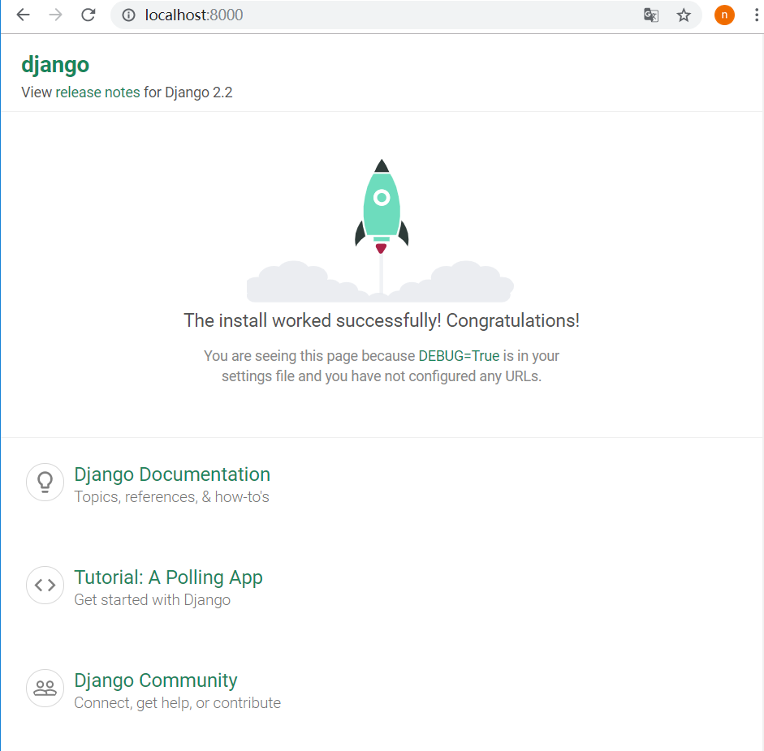
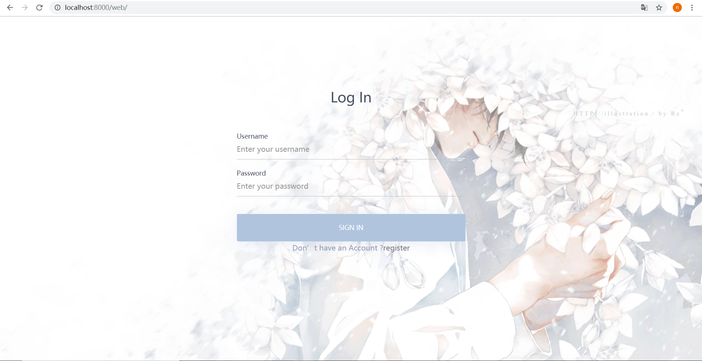
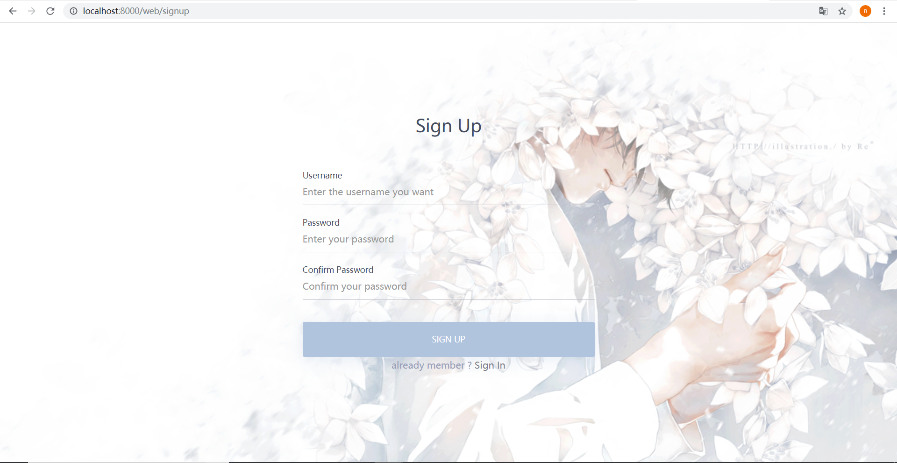

# 软件与系统安全：逆向工程+web开发

## 实验环境

- Windows10
- Django

## 环境搭建

- 在Windows系统中创建虚拟环境（django为环境名）：`mkvirtualenv django`

- 启动虚拟环境：`workon django`

- 安装django：`pip install django`

- 使用django-admin创建新工程（reverse为工程名）：`django-admin startproject reverse`

- 进入工程目录后启动工程：`python manage.py runserver`

- 初次运行manage.py，在浏览器中输入`localhost:8000`出现如下内容：

  

- 在

## 页面展示

- 登录

- 注册

## 参考资料

- [Django官方文档](https://docs.djangoproject.com/zh-hans/2.2/)
- [YouTuber Max Goodridge的Django Tutorials](https://www.youtube.com/playlist?list=PLw02n0FEB3E3VSHjyYMcFadtQORvl1Ssj)
- 