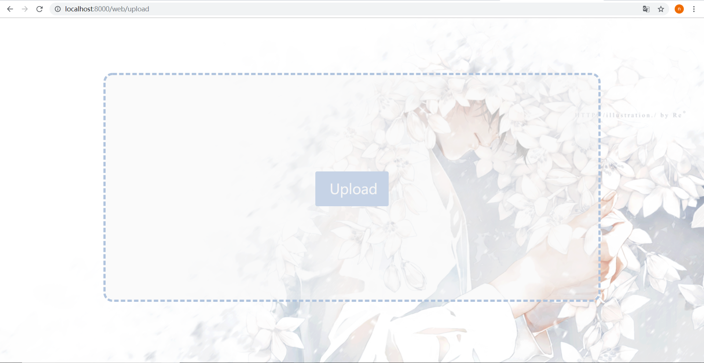

# 软件与系统安全：逆向工程+web开发

## 实验环境

- Windows10
- Django

## 环境搭建

- 在Windows系统中创建虚拟环境（django为环境名）：`mkvirtualenv django`

- 启动虚拟环境：`workon django`

- 安装django：`pip install django`

- 使用django-admin创建新工程（reverse为工程名）：`django-admin startproject reverse`

- 进入工程目录后启动工程：`python manage.py runserver`

- 初次运行manage.py，在浏览器中输入`localhost:8000`出现如下内容：

  

- 在

## 后端代码

- 数据库连接：`models.py`

```python
from django.db import models

# Create your models here.
class User(models.Model):
    username = models.CharField(max_length=100)
    password = models.CharField(max_length=100)
    filename = models.CharField(max_length=100)

class document(models.Model):
    filename = models.CharField(max_length=100)
    user_id = models.ForeignKey(User, on_delete=models.CASCADE)
    timestamp = models.DateField()
    document = models.FileField(upload_to='documents/')
```

- 路由：`urls.py`

```python
from django.urls import path
from . import views

urlpatterns = [
    path('', views.login, name='login'),
    path('signup', views.signup, name='signup'),
    path('upload', views.upload, name='upload')
]
```

- 注册：`view.py: signup`

```python
# 注册
def signup(request):
    if request.method == 'POST':
        username = request.POST['username']
        password = request.POST['password']
        if username and password:
            # 数据库添加
            user = User(username=username, password=password, filename='')
            user.save()
            return JsonResponse({
                'success': True,
                'redirect': '/web',
            })
        else:
            print('No such user')
    return render(request, 'web/signup.html')
```

- 登录：`view.py: login`

```python
# 首页
def login(request):
    if request.method == 'POST':
        username = request.POST['username']
        password = request.POST['password']
        if username and password:
            # 数据库查询
            try:
                is_user = User.objects.get(username=username)
            except ObjectDoesNotExist:
                print('no such user!')
                return render(request, 'web/login.html')
            print(is_user)
            # return render(request, 'web/login.html')
            return JsonResponse({
                'success': True,
                'redirect': 'upload',
            })
        else:
            print('No such user')
    return render(request, 'web/login.html')
```


## 页面展示

- 登录


- 注册


- 上传




## 参考资料

- [Django官方文档](https://docs.djangoproject.com/zh-hans/2.2/)
- [YouTuber Max Goodridge的Django Tutorials](https://www.youtube.com/playlist?list=PLw02n0FEB3E3VSHjyYMcFadtQORvl1Ssj)
- 